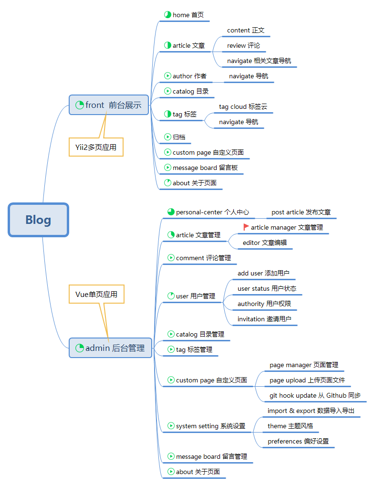

Vue2 in Yii2
===============================
1. init project
    ```bash
    composer install
    bower install
    (php) init
    (php) yii migrate
    cd vue2
    npm install
    
    #for build to yii, will distribute to vue2-in-yii2\backend\web\dist (or frontend\web\dist)
    #blog URL:f.localhost
    #admin URL:b.localhost:82/#/signup
    npm run build-module admin
    npm run build-module home
    
    #for debug, preview at localhost:8091/views/admin.html (or views/home.html)
    npm run dev
    ```

2. apache config
    ```
    <VirtualHost *:80>	#vue2-in-yii2\backend
        ServerAdmin webmaster@example.com
        DocumentRoot "{YOUR PROJECT DIR}\backend\web"
        ServerName b.localhost
        ErrorLog "logs/backend-error.log"
        CustomLog "logs/backend-access.log" common
    </VirtualHost>
    
    <VirtualHost *:80>	#vue2-in-yii2\frontend
        ServerAdmin webmaster@.example.com
        DocumentRoot "{YOUR PROJECT DIR}\frontend\web"
        ServerName f.localhost
        ErrorLog "logs/frontend-error.log"
        CustomLog "logs/frontend-access.log" common
    </VirtualHost>
    ```
3. Demo:
    
     - my new blog : [test.zchi.me](http:test.zchi.me)
     - screenshots :
     
     
     
4. PROJECT STRUCTURE

        
 
5. **This is an unfinished project**


-------------------
DIRECTORY STRUCTURE
-------------------


```
common
    config/              contains shared configurations
    mail/                contains view files for e-mails
    models/              contains model classes used in both backend and frontend
    tests/               contains tests for common classes    
console
    config/              contains console configurations
    controllers/         contains console controllers (commands)
    migrations/          contains database migrations
    models/              contains console-specific model classes
    runtime/             contains files generated during runtime
backend
    assets/              contains application assets such as JavaScript and CSS
    config/              contains backend configurations
    controllers/         contains Web controller classes
    models/              contains backend-specific model classes
    runtime/             contains files generated during runtime
    tests/               contains tests for backend application    
    views/               contains view files for the Web application
    web/                 contains the entry script and Web resources
frontend
    assets/              contains application assets such as JavaScript and CSS
    config/              contains frontend configurations
    controllers/         contains Web controller classes
    models/              contains frontend-specific model classes
    runtime/             contains files generated during runtime
    tests/               contains tests for frontend application
    views/               contains view files for the Web application
    web/                 contains the entry script and Web resources
    widgets/             contains frontend widgets
vendor/                  contains dependent 3rd-party packages
environments/            contains environment-based overrides
vue2/                    vue2 project
```
